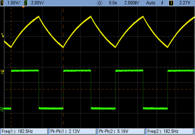
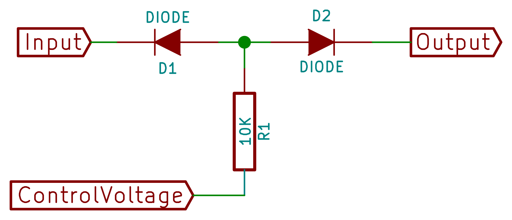
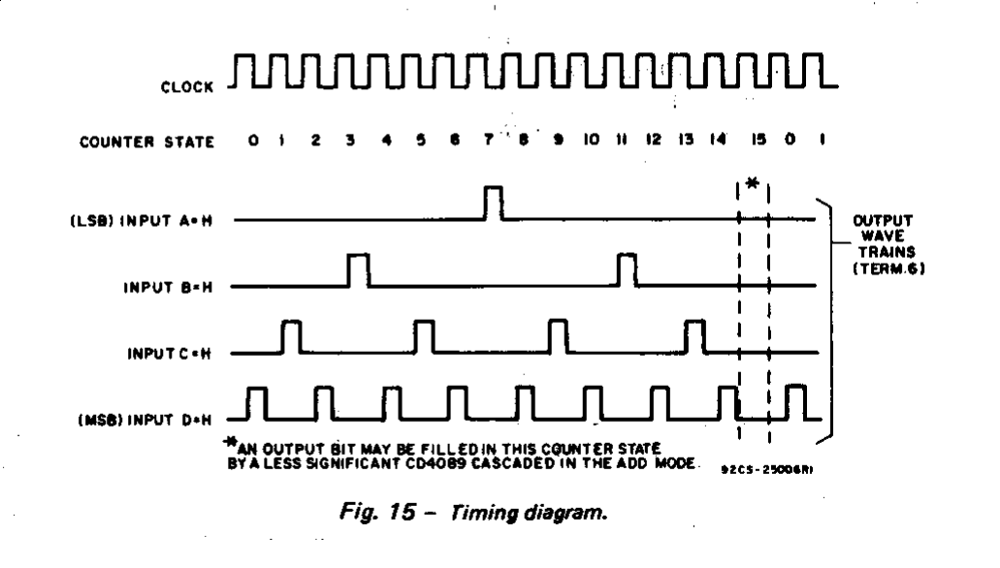
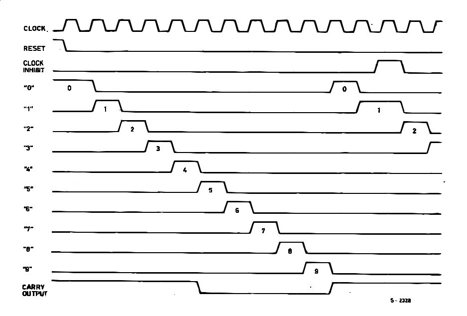
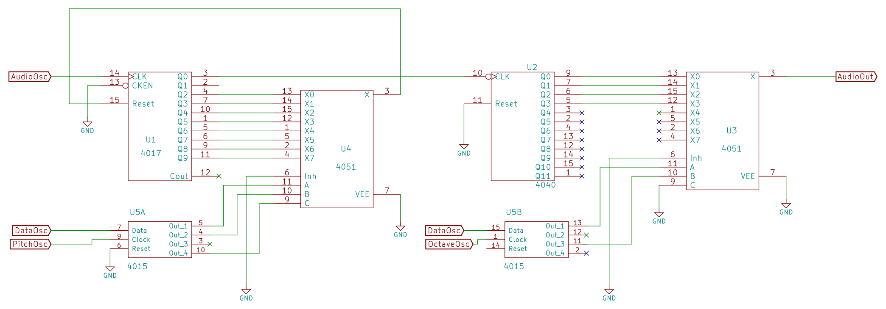

# Logic Noise 

## Logic Noise

**Hacking Music out of Digital Chaos**

Elliot Williams

Hackaday

## Today's Menu

- 4000-series CMOS Logic ICs

- Some Analog

- Demos Galore and some Circuit Diagrams

- (Musical Philosophy)

## What is Music?

- Bunch of notes...

- that you expect.

- But not too obvious either

- Rhythm and repetition but also variety

# Tone, Pitch, and Dynamics

## Oscillator: 40106

- It all starts with [an oscillator](https://hackaday.com/2015/02/04/logic-noise-sweet-sweet-oscillator-sounds/)

{height=350px}

- Capacitor and resistor determine the pitch

## Timbre

[Diode Sync](https://hackaday.com/2015/02/04/logic-noise-sweet-sweet-oscillator-sounds/) 
 
{height=450px}

## More Timbre

- [Analog tricks with 4069UB](https://hackaday.com/2015/03/09/logic-noise-sawing-away-with-analog-waveforms/):  
   triangle and sawtooth waveforms

{height=250px}

- 4070 [XOR](https://hackaday.com/2015/04/10/logic-noise-more-cmos-cowbell/) Cowbell / Cymbals

## Pitch: Analog

- Change resistance or capacitance

- [4051 Multiplexer](https://hackaday.com/2015/02/23/logic-noise-the-switching-sequencer/) switchable resistances

- [Change the charging current](http://electro-music.com/forum/viewtopic.php?highlight=synthmonger+vco&t=28799)

## Pitch: Digital

- Octaves, divide by 2:  [Binary counters](https://hackaday.com/2015/02/17/logic-noise-8-bits-of-glorious-sounds/)

- Divide by N:  4017 decade counter w/ reset

- 4051 mux again:  8 oscillators enter, only one leaves

## Dynamics: Digital

- Stall oscillator with diode

- Power on and off 

- [4066 quad switch](https://hackaday.com/2015/07/02/logic-noise-ping-pong-stereo-mixers-and-more/)

	-- On output

	-- On power rail with capacitor(!)

## Dynamics: Analog

- Power on and off (plus capacitor for decay)
 
- [Two-diode VCA](https://hackaday.com/2015/04/10/logic-noise-more-cmos-cowbell/) (needs buffer, sorry)

{height=250px}

- 4007 VCA 

# Rhythm

## Booomm-Tss: 4040 Binary counter

- Pitch turns into tempo around 15 Hz

- Whole note, half note, quarter note, eighth note... 

- Four on the floor

## Fixing the 4040

{height=250px}

- Invert outputs you care about

- But keep the non-inverted too: backbeats

## Rhythmic Shortcuts: 4089

{height=350px}

- 4089 "rate multiplier" chip is beats in a box

## One Pulse per Step: The Mighty 4017

- Puts out one of up to ten outputs per clock

{height=350px}

- Use pulses to trigger oddly-timed events

## It don't mean a thing...

- [if it ain't got that swing](http://www.electro-music.com/forum/post-361142.html) (clock)

{height=350px}

- 4017 + 4040 = regular, off-grid time

# All Together

## Melody Generator ++

- [Melody generator](http://electro-music.com/forum/topic-27239-50.html)

- 4017 makes pitches by division

- One of eight outputs to reset through 4051 mux

- Three digital lines into 4051 pick "note"

- My twist: add some octaves with a 4040,  drive with SR

## Melody Generator ++

{height=350px}

## Melody Generator ++

- Control pitch / octave through  paired clock and data lines

- Inject sequence into SR, loop it

- Feed clock / data with detuned oscillators

- Tweak until "just right"

## What's Next?

- Tremendous room for playing around

- Incorporate microcontroller, FPGA

- Build standalone instruments

- Priority encoders, complex logic

- Turn away from "music",  embrace noise.

# The End

## Fittingly Offbeat References

- [Stanley Lunetta](http://moosack.net/stang/sculpts.html)

- [David Tudor](https://davidtudor.org/Electronics/electronics.html)

- [Peter Vogel](http://www.petervogel-objekte.de/ObjKlang.html)

- [Nicolas Collins](http://www.nicolascollins.com/read.htm)

- [Electro-Music "Lunetta" Forum](http://www.electro-music.com/forum/forum-160.html)

- [Logic Noise](https://hackaday.com/tag/logic-noise/) on Hackaday

- Don Lancaster's _CMOS Cookbook_

## Contact

elliot.williams@hackaday.com

https://hackaday.com/author/hexagon5un/

