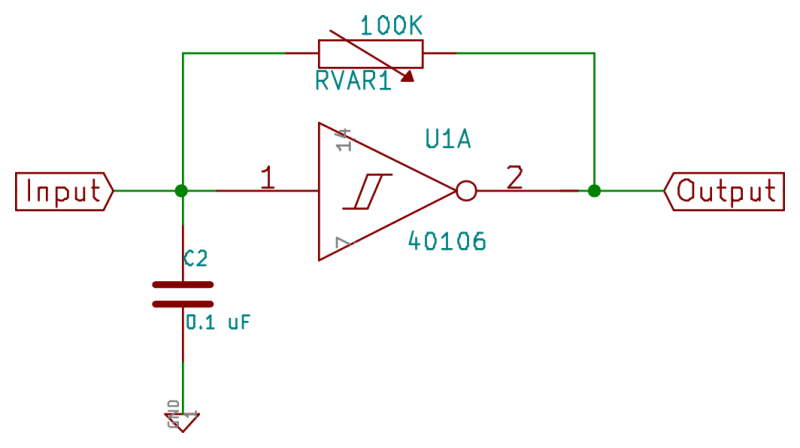
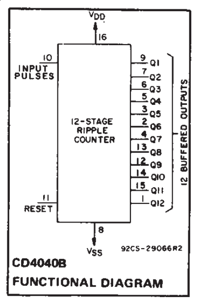
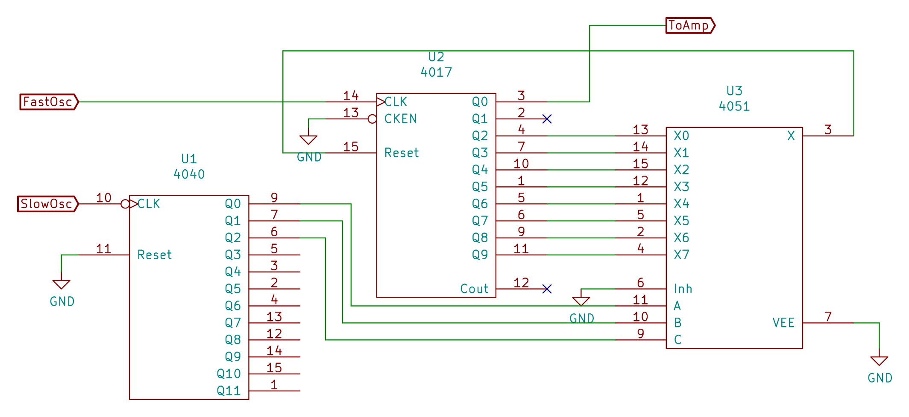

# Logic Noise Workshop

## Welcome! 

{}

## Today's Menu

- 4000-series CMOS digital logic ICs
- Some Analog
- Breadboard Heroics
- Noise
- As much as time allows, maybe more...

# Orientation

## The Kit

- Breadboard, battery, buttons, capacitors, 
   resistors, pots, wires, speaker
- Chips!

## The Flow, The Chips

- Output: 4069UB inverter as amplifier into speaker
- Oscillator: 40106 inverter as oscillator
- Clock Division: 4040 binary counter
- Pitches: 4017 decade counter 
- Switches: 4051 8-way multiplexer
- Looper: 4094 shift register 

## 4000-Series Logic Layout

- Handout
- VCC / GND
- Inverters have common layout
- Other chips?  Read the datasheet.
- Golden Rules for Use:
	- Ground unused inputs
	- 0.1 uF decoupling capacitors

# Output Amp

## Easy Warm Up

- Grab the footprints handout
- Connect up the power:  VCC, GND to the breadboard's power rails
- Pin 7 (Output of Inverter C) to capacitor
- Capacitor to one leg of speaker
- Other leg of speaker to ground

## Test it out

- Input of inverter C (pin 6)  alternately to VCC and GND
- Hear pops?  Woot.

# My First Oscillator

## 40106 Inverter

- A lot like the 4069, but...
- ... with hysteresis
- Separate high and low thresholds create deadband

## Relaxation Oscillator

{height=500px}

## 40106 Action

- The hysteresis keeps the oscillator oscillating
- Imagine the capacitor starts out uncharged
- With input low, output goes high 
- Charges capacitor up through resistor
- When cap voltage hits high, output goes low
- Low output drains cap through resistor...

## Voltages

{height=500px}

## Hook it up

- Power rails
- Capacitor on input to ground
- Potentiometer between input/output
- Output to the amplifier 

{height=200px}

## The Diode Trick

- OK, that gets old fast
- How to trigger this thing?  
- Brutal approach: plug and unplug the power
- Put a pushbutton inline with the amplifier
- More Useful: stall out the oscillator with a diode
- Depending on polarity of diode,  high or low signal blocks blocks oscillation

## Sync Oscillators

- Build up another oscillator real quick 
- Higher frequency: 0.01 uF (103) cap
- Connect output of the first into its input via diode
- Move amplifier input to the higher-pitch oscillator

## Sync Oscillator

{height=500px}

## Sync Oscillator

{height=500px}

# From Pitches to Beats

## 4040 Binary Counter

{height=400px}

## 4040 Binary Counter

{height=400px}

## Hookup

- Power up!
- Take the sync oscillator output,  connect to 4040 clock
- Hook up random outputs of the 4040 to amplifier
- Play "find the octaves"
- (Why couldn't they put the outputs in order?)

## Variation 

- The slow divisions are very slow
- Connect one to an oscillator with a diode  like the sync oscillator

## Distraction 

- Stacking and mixing octaves sounds great
- Check out the Logic Noise article on the 4040 
- To do this right, need to modify amplifier

# Digital Pitches

## Divide-by-N

- Dividing by 2 gives us octaves
- Other notes?
- Divide by other factors

## 4017 Counter

{height=400px}

## Hookup

- Power (yawn)
- Inhibit line high
- High-pitch oscillator into 4017 clock
- Amplifier to Q0
- Different outputs Q1-Q9 to reset line

## Variation

- Diode trick lets you  use multiple pulses per cycle
- Use the count outs of 4017 as clock pulses
- Make uneven clocks or funky rhythms

# Analog Switches

## 4051 Multiplexer

- 4051 is an 8-way switch
- Binary input on A, B, C 
- Connects X0-X7 to Common
- Bipolar: VEE can be negative, VSS is logic GND
- Not hi-fi, but can switch 8 audio sources

## Simplest Hookup

- VCC to power
- Inhibit, VEE, and VSS all to GND
- A, B to GND
- C directs input between common and X0, X1

## Our Goal: Melody Generator

- High freq oscillator back to 4017 counter for pitches
- Select among reset pulses through 4051
- But need to count to 8
- Low-freq oscillator into 4040
- 4040 outputs into 4017's A,B,C

## Build it!

- Connect up the rest of switches to 4017 stages
- Drive A, B, and C all from the 4040
- Experiment with the ordering of bits and which switch inputs to which 4017 outs

## The Melody Generator

{height=500px}

# Extra Credit: Looper

## Shift Register

- Bucket Brigade / Hot Potato
- Inputs: Data, Clock, Strobe, Enable
- Outputs: Q1-Q8, "Qs" overflow
- Close on itself, loops around

## 4094 Block Diagram

{height=500px}

## Loop It!

- Power
- Output enable high
- Clock _and_ strobe to slow clock 
- Resistor from Qs to data
- Pick off three stages into 4051

## Run It

- As is, it will circulate zeros
- Override data line, pulling to VCC or GND
- Connecting pushbuttons high/low is great
- Pro tip: slow clock down entering patterns

# Wrapup

## What's Next?

- Tremendous room for playing around

- Incorporate microcontroller, FPGA

- Hack this into the badge

- Build standalone instruments

## References

- [Stanley Lunetta](http://moosack.net/stang/sculpts.html)

- [David Tudor](https://davidtudor.org/Electronics/electronics.html)

- [Peter Vogel](http://www.petervogel-objekte.de/ObjKlang.html)

- [Nicolas Collins](http://www.nicolascollins.com/read.htm)

- [Electro-Music "Lunetta" Forum](http://www.electro-music.com/forum/forum-160.html)

- [Logic Noise](https://hackaday.com/tag/logic-noise/) on Hackaday

- Don Lancaster's _CMOS Cookbook_

## Contact

elliot.williams@hackaday.com

https://hackaday.com/author/hexagon5un/

